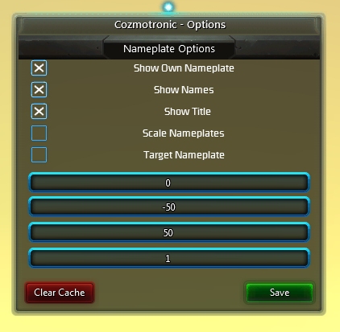

# Cozmotronic
Cozmotronic is the successor to PDA. Based on the same principle behind PDA, it relies on a completely rewritten Communication Engine to allow the transfer of profile data between player.
As wished by PDA's original owner ToggleButton, Cozmotronic uses it's own UI and format for handling profiles in WildStar.

# Usage
Cozmotronic can be accessed in several ways:

* type `/cozmo` in the chat to open the main window.
* click on the `RP` button above your character.
* Use the configure button in the main menu for the options.
* Use the button in the Interface List to toggle between IC and OCC modes.

# Main Screen
Cozmotronic allows you to store many interesting details about your character, using a simple form.
When filled in and saved, this information will also be transmitted to other players.

# Options
When you click the big Cozmotronic button in the main menu, the options Window will be displayed.
Here you can change various settings as well as reset the stored player cache.
At the moment the settings that can actually be changed are rather limited.

